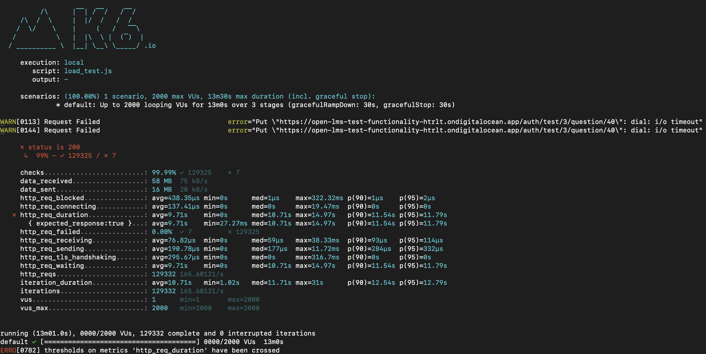

# open-lms-test-functionality

This project will user Go version  1.22

### Setup
Run `go install` in project directory.

#### Migration Notes
- `migrate` library for managing migrations.
- Command to create migration : `migrate create -ext sql -dir migrations -seq -digits 6 <migration_name>`. This command will generate migrations in `migrations` directory.

#### Statistics
##### Resource used for this testing
- Cloud Provider: Digital Ocean
- Server: 1 vCPU / 1 Gb RAM 
- No of server: 2
- Database : Postgres 16 - 1 vCPU / 1 Gb RAM

1) Create question: True or False type

2) Create question: Multiple choice type

3) Get question list with pagination of 10 questions

4) Get question list with pagination of 50 questions

5) Submit question answer

#### Library reference
- JWT: `https://github.com/appleboy/gin-jwt/`
- Migrate: `https://github.com/golang-migrate/migrate`
- Gin: `https://github.com/gin-gonic/gin`

#### Tools for testing concurrent requests
- K6: `https://k6.io`